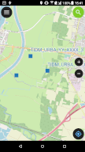
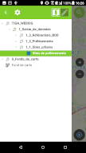

Vous trouverez ici une application de saisie d'obervations de la qualité des sols.
Elle a été réalisée dans le cadre du projet TI Dijon Métropole
L'application a été conçue pour fonctionner sous Qfield.
Les données saisies sont stockées dans le fichier data.gpkg au format [geopackage](https://www.geopackage.org/)

Si vous souhaitez utiliser ces projets, merci de respecter la licence [CeCILLv2](https://cecill.info/licences.fr.html). Si vous souhaitez y contribuer, merci de nous contacter : contact@agaricig.com pour partager

